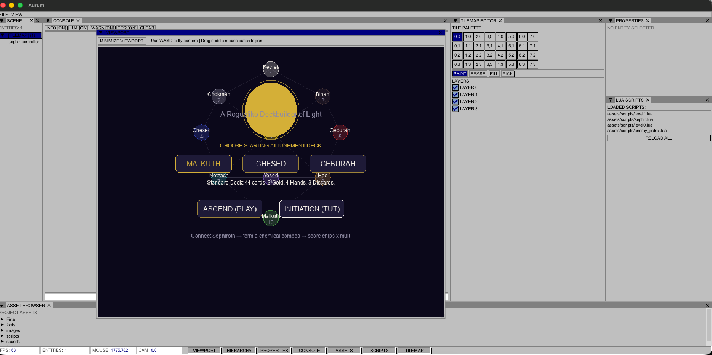
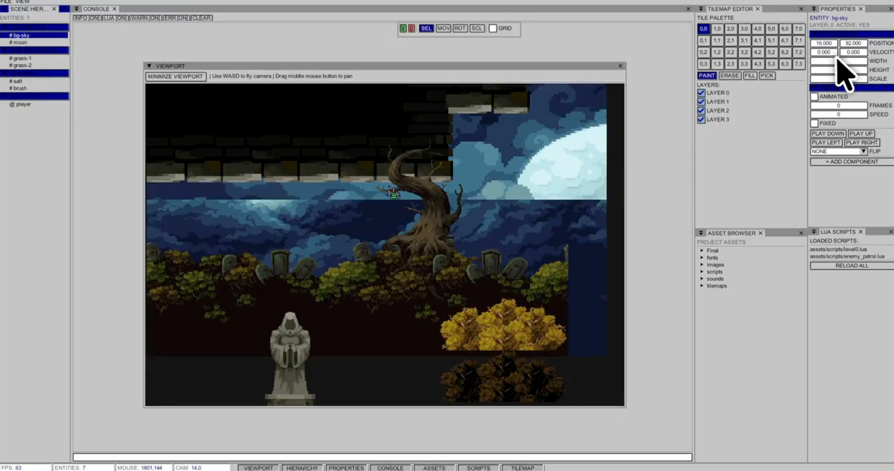

<h1 align="center">Aurum</h1>

<p align="center">a 2D game engine built in <strong>C++</strong> with <strong>SDL2</strong>.</p>

---

## Preview




---

## Features

- **Aurum uses an Entity-Component System (ECS) architecture to keep game objects composable and data-driven**
- **Editor is available at imgui-stuff branch although its not perfect ( yet )

---

## Building

**Dependencies** — install via Homebrew:

```bash
brew install sdl2 sdl2_image sdl2_ttf sdl2_mixer
```

**Build & run:**

```bash
make        # compiles to ./aurum
make run    # runs ./aurum
make clean  # removes the binary
```

---

## References & Inspiration

Aurum was built while following and drawing ideas from:

- [**Pikuma — 2D Game Engine**](https://pikuma.com/courses/cpp-2d-game-engine-development) 
- [**Birch Engine**](https://github.com/ambrosiogabe/Birch-Engine) — 
- [**SDL Game Development** by Shaun Mitchell](https://www.packtpub.com/product/sdl-game-development/9781849696821) 
- [**LÖVE**](https://love2d.org/) 
- [**Godot Engine**](https://godotengine.org/) 
- [**raylib**](https://www.raylib.com/)
---

## License

MIT
